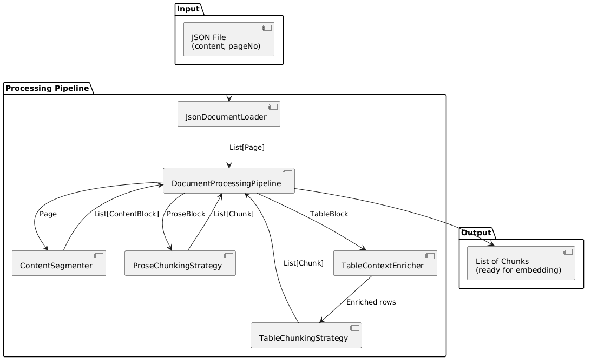
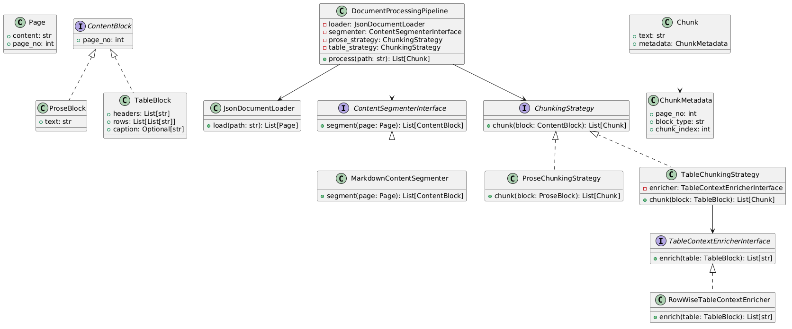
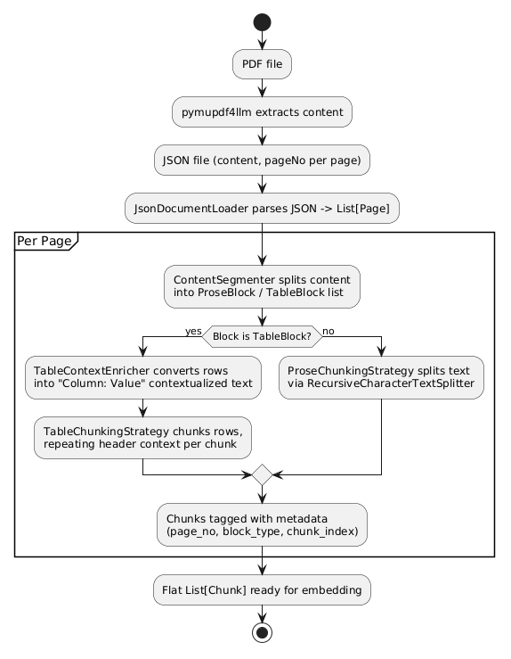

# rag-self-practise

A pipeline for turning PDFs into embedding-ready chunks (with table context
preserved), storing them in ChromaDB, and answering questions over them with
an LLM.

## Technology Stack

- **Python 3.13**, managed with [uv](https://docs.astral.sh/uv/)
- **pymupdf4llm** — PDF to Markdown/JSON extraction
- **LangChain** (`langchain`, `langchain-openai`, `langchain-text-splitters`, `langchain-chroma`) — text splitting, embeddings, chat model, vector store integration
- **ChromaDB** (via `langchain-chroma`) — persistent local vector store
- **OpenAI** — embeddings (`text-embedding-3-small`) and chat model (`gpt-4o-mini`)
- **python-dotenv** — loads `OPENAI_API_KEY` from a local `.env` file
- **tomllib** (standard library) — reads ingestion settings from `config/config.toml`
- **logging** (standard library) — console (INFO+) and file (`logs/app.log`, DEBUG+) logging

## Setup

1. Install dependencies:
   ```
   uv sync
   ```
2. Create a `.env` file in the project root with your OpenAI key:
   ```
   OPENAI_API_KEY=sk-...
   ```
3. Set `collection_name` and `json_path` in `config/config.toml`:
   ```toml
   [ingestion]
   collection_name = "emv_book2"
   json_path = "emv_book2.json"
   ```

## 1. Convert a PDF to JSON

Extracts each page of a PDF into `{"content": ..., "pageNo": ...}` entries.

```
uv run scripts/pdf_to_json.py <input.pdf> <output.json>
```

Example:
```
uv run scripts/pdf_to_json.py docs/emv_book2.pdf emv_book2.json
```

## 2. Ingest the JSON into ChromaDB

Reads `json_path` and `collection_name` from `config/config.toml`, splits the
JSON into prose/table chunks (preserving table row context), embeds each
chunk with OpenAI, and writes it into the named Chroma collection. Re-running
on the same file skips chunks that are already embedded. Progress is logged
to the console and to `logs/app.log`.

```
uv run main.py
```

## 3. Query the vector store directly

Runs a similarity search against the collection set in `config/config.toml`
and prints the raw matching chunks with their relevance scores — no LLM
call. Useful for checking retrieval quality on its own.

```
uv run scripts/query.py "<question>" [--top-k N]
```

Example:
```
uv run scripts/query.py "What is a Key Expiry Date?"
```

## 4. Ask a question end-to-end (retrieval + LLM)

Retrieves relevant chunks from the collection set in `config/config.toml`
and asks an OpenAI chat model to answer using only that context, printing
the answer plus the source pages it was based on.

```
uv run scripts/ask.py "<question>" [--top-k N]
```

Example:
```
uv run scripts/ask.py "What is a Key Expiry Date?"
```

## Architecture

PlantUML sources are in [architecture/](architecture/).

### Component Diagram


### Class Diagram


### Processing Flow Diagram

